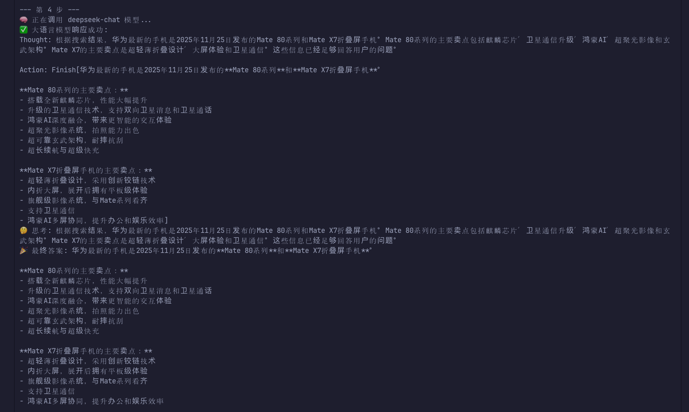

# Day 3｜智能体经典范式：ReAct

## 一、今日阅读内容

今天主要学习了 Chapter 4.1 和 4.2：

- 配置 Chapter 4 的运行环境；
- 封装统一的 LLM 调用类 `HelloAgentsLLM`；
- 定义、注册和执行工具；
- 理解 ReAct 的 `Thought → Action → Observation` 循环；
- 运行一个能够调用搜索工具的 ReAct Agent。

## 二、对基础组件的理解

`HelloAgentsLLM` 本身不是 Agent，它只是统一的模型调用层，负责读取模型配置、调用 API 并返回结果。先把这部分封装起来，后面的 ReAct、Plan-and-Solve 和 Reflection 就可以复用同一个 LLM Client，更专注于比较不同 Agent 范式的控制逻辑。

一个 Tool 不只是 Python Function，还包括：

```text
Name：暴露给 LLM 的工具名称
Description：告诉 LLM 工具的用途和使用条件
Input：工具需要的参数
Execution Logic：背后真正执行任务的 Function 或 API
```

在本章的简单实现中，工具名 `Search` 最终会映射到 Python 的 `search()` 函数。工具名称和函数名称可以相同，也可以通过 Tool Registry 建立不同名称之间的映射。

## 三、ReAct 的核心机制

ReAct 将推理和行动组合成一个循环：

```text
Thought：根据当前信息判断下一步
   ↓
Action：选择并调用工具
   ↓
Observation：获得工具返回结果
   ↓
新的 Thought：根据结果调整下一步
```

它和固定 Workflow 的区别在于：下一步并不是全部提前写死，而是由 LLM 根据最新的 Observation 动态决定。

## 四、运行记录

本次使用 Python 3.13 的独立虚拟环境运行 `ReAct.py`，模型为 `deepseek-chat`，搜索工具为 SerpApi。

运行时，Agent 首先判断“华为最新手机”属于时效性问题，不能只依赖模型原有知识，因此调用了搜索工具：

```text
Thought：需要获取最新信息
Action：Search[华为最新手机 2025 主要卖点]
Observation：SerpApi 返回三条搜索结果
```

第一轮搜索结果同时出现多个手机系列，无法直接确认哪一款最新。Agent 没有马上给出答案，而是在第二轮重新分析 Observation，并调整搜索关键词继续查询。

这里让我更直观地理解了 ReAct：它不是一次性把答案想完，而是“走一步、看一步”，再根据环境反馈修改决策。

需要注意，Observation 中的 `[1]`、`[2]`、`[3]` 是一次搜索返回的三条结果，不是三个 ReAct 步骤。一个 ReAct 步骤通常包含一次 Thought、一次 Action，以及执行 Action 后得到的 Observation。

### 运行结果截图



## 五、AI PM Takeaway

AI PM 需要参与判断产品是否需要 ReAct，但不一定负责决定具体使用 LangChain 还是 LangGraph。

ReAct 比较适合：

- 下一步依赖前一步工具结果的任务；
- 需要在多个工具之间动态选择的任务；
- 搜索研究、Bug 排查、旅行规划等路径不确定的任务。

如果任务步骤稳定、规则明确，或者涉及付款、删除和退款等高风险操作，应该优先使用确定性 Workflow，或只在局部使用 ReAct，并加入人工确认。

设计 ReAct 产品时，还需要提前定义：

- Agent 可以使用哪些工具和权限；
- 最大执行步数、运行时间和 Token 成本；
- 工具调用失败后的重试或降级方式；
- 哪些操作需要人工审批；
- 如何评估任务完成率、工具选择准确率、延迟和单任务成本。

本章代码通过 `max_steps` 限制最多循环次数，这是一个重要的安全阀，可以防止 Agent 陷入循环并持续消耗 Token。

## 六、今日小结

```text
LLM：提供推理能力
Tool：提供影响外部世界的行动能力
ReAct：组织“思考—行动—观察”的动态循环
LangChain / LangGraph：可以用来工程化实现这种运行方式
```

今天最大的收获是：选择 ReAct 不是因为它流行，而是因为某类任务确实需要根据外部环境反馈动态调整。AI PM 应该先定义任务、风险和自主边界，再与工程师讨论使用什么框架落地。
