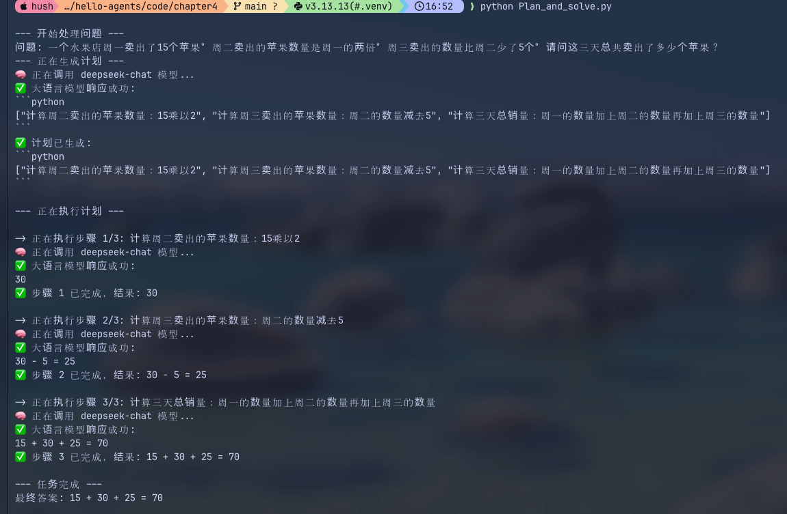
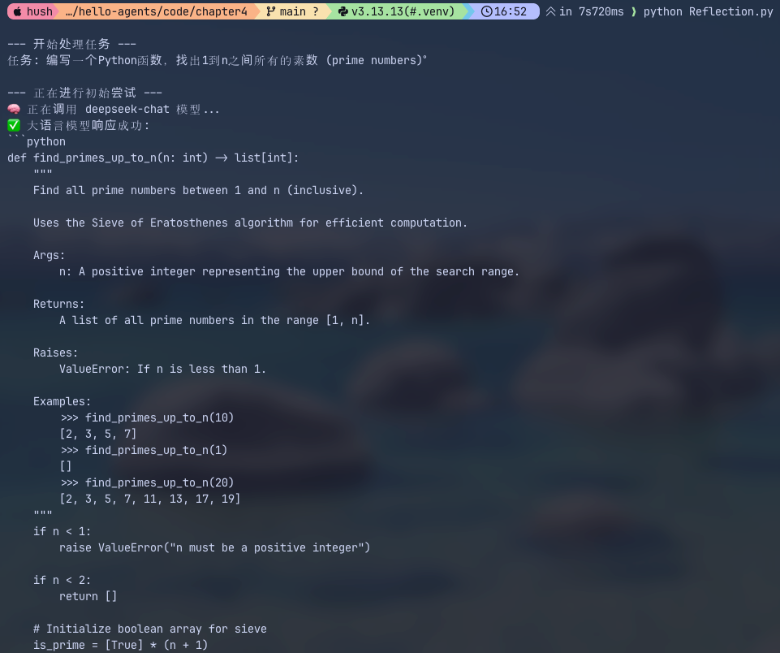
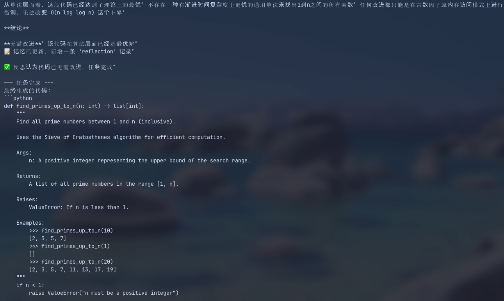

# Day 4｜Plan-and-Solve 与 Reflection 阅读笔记

## 一、今日学习目标

今天继续学习智能体经典范式，重点理解：

- Plan-and-Solve 如何通过“先规划、再执行”处理复杂任务；
- Reflection 如何通过“执行、反思、优化”改善结果；
- 三种范式分别解决什么问题；
- AI PM 应该如何根据任务特点选择范式，而不是只记概念名称。

## 二、Plan-and-Solve

### 1. 核心机制

Plan-and-Solve 会先让 Planner 把复杂目标拆成一个完整计划，再由 Executor 按顺序执行：

```text
用户目标
  ↓
Planner：生成完整计划
  ↓
Executor：执行步骤 1
  ↓
Executor：执行步骤 2
  ↓
继续执行并汇总结果
```

它解决的是 ReAct 容易“只关注眼前一步、缺少全局结构”的问题，比较适合调研报告、复杂分析和项目任务。

### 2. 代码结构

课程代码主要包含：

- `Planner`：将问题拆解成 Python List 格式的步骤；
- `Executor`：按照计划逐步执行，并保存历史结果；
- `PlanAndSolveAgent`：组合 Planner 和 Executor；
- `history`：保存已经完成的步骤和结果，让后续步骤可以利用前面的信息。

代码位置：[Plan_and_solve.py](../code/chapter4/Plan_and_solve.py)

### 3. 优势与限制

优势：

- 执行结构比较清楚；
- 复杂任务不容易遗漏关键步骤；
- 计划可以展示给用户确认；
- 方便观察任务进度。

限制：

- 初始计划如果错误，后续可能沿着错误方向执行；
- 环境变化后，原计划可能不再适用；
- 每个步骤都可能调用 LLM，带来延迟和 Token 成本；
- 实际产品通常还需要加入 Replanning，在执行失败时调整计划。

## 三、Reflection

### 1. 核心机制

Reflection 是一种事后质量改进循环：

```text
Execution：生成第一版结果
  ↓
Reflection：以评审员角色检查问题
  ↓
Refinement：根据反馈生成修改版
  ↓
再次评审，或达到停止条件
```

课程案例要求 Agent 生成“找出 1 到 n 之间所有素数”的 Python 函数。评审员会检查算法效率，并建议从普通试除法优化为埃拉托斯特尼筛法。

### 2. Memory 的作用

Reflection 需要记住：

```text
上一版代码
评审反馈
修改后的代码
新的评审反馈
```

课程中的 `Memory.records` 只是一个简化的当前任务工作记忆。它不等于 Agent Memory 的全部，也不是 Reflection 专属能力。

- ReAct 的 Memory 保存 Action 和 Observation；
- Plan-and-Solve 的 Memory 保存计划、进度和步骤结果；
- Reflection 的 Memory 保存初稿、反馈和修订版本。

代码位置：[Reflection.py](../code/chapter4/Reflection.py)

### 3. 停止条件

Reflection 不能无限优化。课程代码设置了两个停止条件：

```text
评审返回“无需改进”
或
达到 max_iterations
```

这说明 Reflection 追求的不是无法证明的“绝对最优”，而是在有限预算内达到预设质量标准。

### 4. 局限性

课程代码主要依靠 LLM 自己评审 LLM 的输出，但“模型认为正确”不代表结果真的正确。同一个模型可能遗漏原来的错误，甚至把正确内容改错。

真实产品中应该尽量加入外部验证：

| 任务 | 更可靠的反馈方式 |
| --- | --- |
| 代码生成 | Unit Test、Lint、性能测试、安全扫描 |
| 信息抽取 | JSON Schema、字段规则、标准答案 |
| 数据分析 | SQL 校验、数据质量规则、统计检查 |
| 研究报告 | 引用校验、来源核对、人工审核 |
| PRD | Requirement Checklist、异常流程覆盖率 |

Reflection 本质上是用更多模型调用、延迟和成本换取结果质量，因此不适合所有任务。

## 四、三种范式的区别

| 范式 | 主要问题 | 工作方式 | 适合场景 |
| --- | --- | --- | --- |
| ReAct | 接下来应该做什么？ | 根据工具反馈边做边调整 | 搜索、排错、浏览器操作 |
| Plan-and-Solve | 整体应该怎么做？ | 先生成计划，再逐步执行 | 调研、分析、复杂项目 |
| Reflection | 已有结果是否足够好？ | 生成、评审、修改 | 代码、报告、PRD |

真实产品不一定三选一，可以组合：

```text
Plan-and-Solve：制定整体计划
        ↓
ReAct：在每个步骤中动态调用工具
        ↓
Reflection：检查最终结果并修改
        ↓
Human-in-the-loop：高风险结果由人工确认
```

## 五、AI PM Takeaway

AI PM 不需要背诵论文公式或手写完整框架，但需要理解范式会如何影响产品行为。

在选择方案时，应该先回答：

1. 任务步骤是固定的，还是需要动态调整？
2. 是否需要先建立全局计划？
3. 第一版结果是否需要额外审查？
4. Agent 可以使用哪些工具和权限？
5. 最大步数、迭代次数、运行时间和成本是多少？
6. 哪些操作必须人工审批？
7. 用什么外部标准判断结果真的变好了？

面向产品设计，更准确的表达不是“我要使用某个流行范式”，而是：

> 这个任务需要先拆解全局计划，执行阶段又需要根据外部结果动态调整，因此采用 Plan-and-Solve 与 ReAct 组合；最终报告通过引用校验和 Reflection 进行质量检查，并限制最多两轮优化。

## 六、学习反思

这几天的课程理论内容较多，但 AI PM 的学习重点不是记住所有历史和名词，而是把每个概念翻译成产品问题：

```text
它解决什么问题？
什么场景适合或不适合？
有什么成本和风险？
需要什么权限和停止条件？
最终如何验收？
```

目前对三种基础范式已经形成初步认识。下一步需要通过真实小项目，将 Tool、Memory、Planning、Reflection、Workflow 和评估指标组合起来，而不是继续停留在概念记忆上。

## 七、实践记录

本次实际运行了 Plan-and-Solve 和 Reflection 两个示例：

```bash
python Plan_and_solve.py
python Reflection.py
```

### 1. Plan-and-Solve 运行结果

示例任务是计算水果店三天卖出的苹果总数。Agent 首先把问题拆成三个步骤：

1. 计算周二销量：`15 × 2 = 30`；
2. 计算周三销量：`30 - 5 = 25`；
3. 计算三天总销量：`15 + 30 + 25 = 70`。



从运行日志可以看出，程序先调用一次 LLM 生成计划，然后针对三个步骤分别调用 LLM 执行，总共进行了 4 次模型调用。最终答案为 70，结果正确。

这次实践让我更直观地看到：Plan-and-Solve 并不是模型一次性回答，而是先把目标转化成结构化计划，再把前面步骤的结果作为历史信息交给后续步骤。它提高了复杂任务的可观察性，但也增加了模型调用次数、延迟和 Token 成本。

### 2. Reflection 运行结果

示例任务是生成一个 Python 函数，找出 1 到 n 之间的所有素数。模型第一版就采用了埃拉托斯特尼筛法，并补充了参数检查、类型标注、说明文档和使用示例。



评审阶段认为这份实现已经达到该任务在算法层面的较优方案，没有提出新的修改意见，并输出“无需改进”。Agent 因此触发停止条件，直接返回初始代码，没有继续执行 Refinement，也没有强行跑满 `max_iterations=2`。



本次实际流程是：

```text
生成第一版代码
  ↓
评审代码
  ↓
评审认为无需改进
  ↓
提前停止并返回结果
```

这次运行说明 `max_iterations` 只是最多允许的迭代次数，并不代表一定会迭代两次。除了设置最大轮数，产品还应该设计“质量已经达标”的提前停止条件，减少无意义的模型调用。

### 3. 实践后的 AI PM 思考

- Plan-and-Solve 的关键产品价值是计划透明、步骤可追踪，但需要衡量任务拆解带来的额外成本。
- Reflection 的关键产品价值是增加质量检查环节，但评审结果仍然来自 LLM，不能直接等同于客观正确。
- 如果这是正式的代码产品，不能只根据模型说“无需改进”就通过，还应该运行 Unit Test、边界条件测试和性能测试。
- 产品验收不应该只看最终答案，还应该记录模型调用次数、总耗时、Token 成本、成功率和停止原因。

