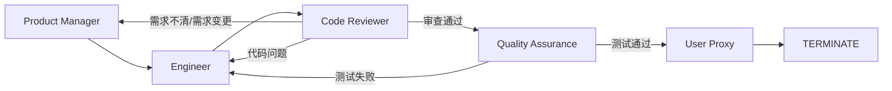
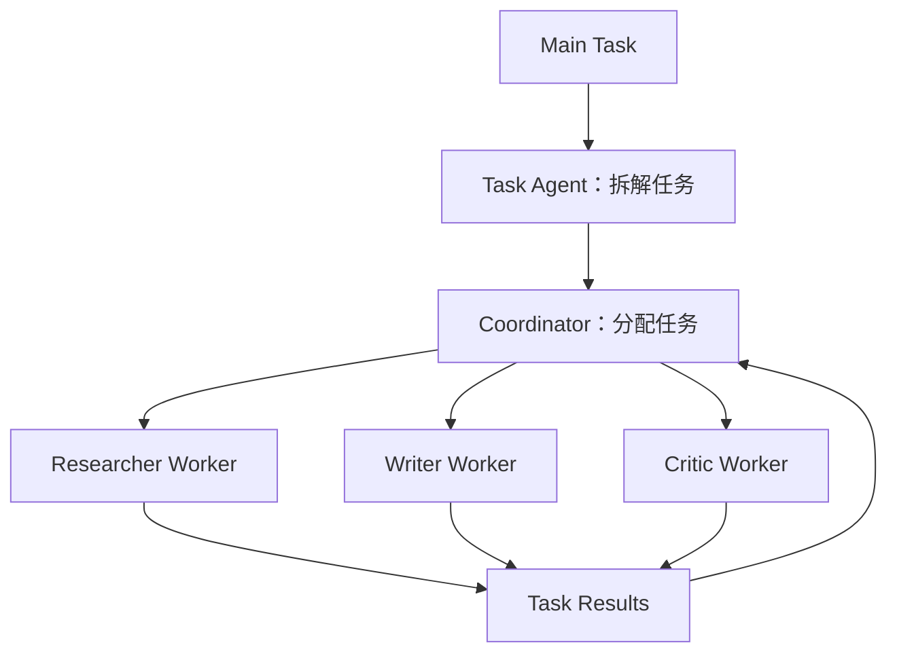
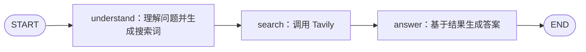
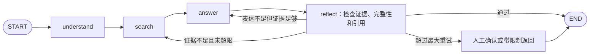
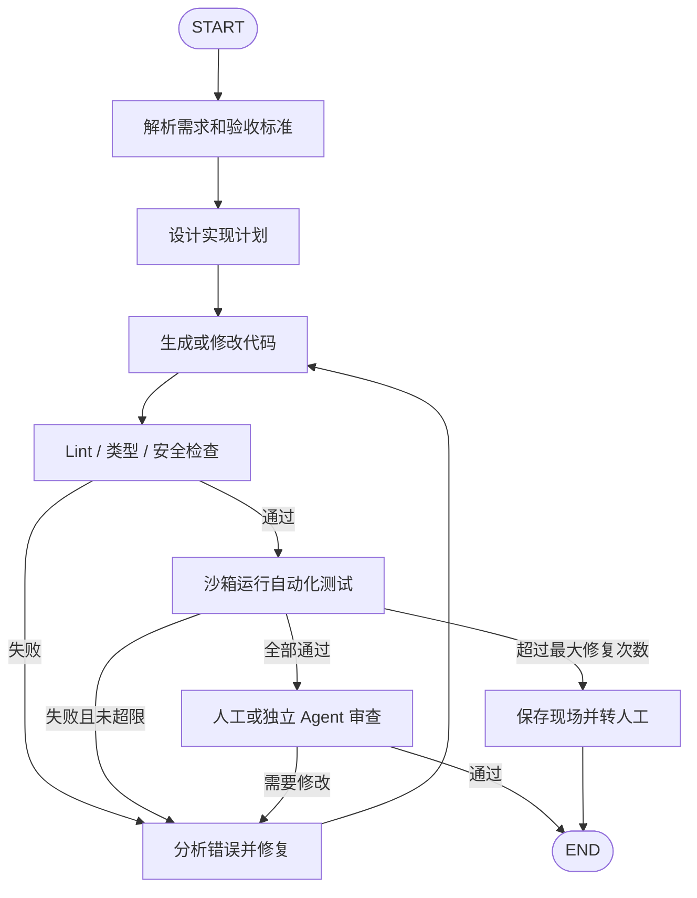
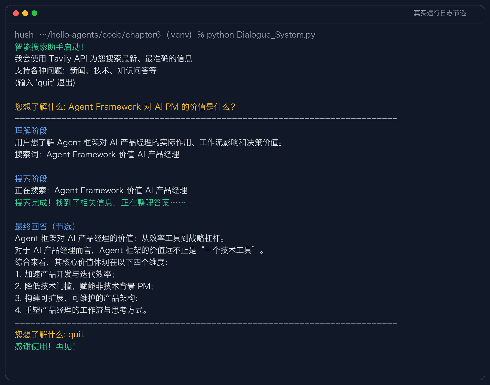

# Day 5｜主流 Agent Framework 对比与选型

## 一、今日学习目标

本章从手写 Agent 进入框架开发。框架不会让 LLM 本身突然变聪明，它主要把 Agent 应用中重复出现的模型接入、工具调用、状态管理、消息通信、循环控制、日志和调试能力封装起来，让团队把精力放在业务逻辑上。

作为 AI PM，我不需要熟记四个框架的 API，但需要能够回答：

```text
产品为什么需要框架？
任务更需要自主协作，还是明确的流程控制？
为什么需要单 Agent 或多 Agent？
需要哪些状态、停止条件和人工审批？
选择框架后会带来什么成本、风险和可维护性问题？
```

## 二、框架认知地图

| 框架 | 最有代表性的设计中心 | 直观理解 | 典型场景 |
| --- | --- | --- | --- |
| AutoGen | Agent 通过消息和对话组成 Team | 数字员工群聊 | 软件团队、研究团队、多角色讨论 |
| AgentScope | 消息、状态、并发和工程化管理 | 多 Agent 工程平台 | 实时互动、大规模多 Agent、生产运维 |
| CAMEL | Role-Playing、Society、Workforce | 角色驱动的数字团队 | 深度讨论、角色协作、开放式研究 |
| LangGraph | State、Node、Edge | Agent 状态机与流程图 | 严格流程、条件分支、循环和人工审批 |

这些框架当前的能力已经存在重叠，因此这张表表达的是各自最有代表性的设计思想，而不是不可跨越的能力边界。

## 三、习题作答

### 思考题 1：AutoGen 与 LangGraph 对比

我选择 AutoGen 和 LangGraph，因为它们分别代表“对话中涌现协作”和“通过图显式控制”两种比较典型的方向。

| 维度 | AutoGen | LangGraph |
| --- | --- | --- |
| 协作模式 | 多个 Agent 通过消息和群聊协作，角色职责推动任务前进 | 将任务建模为状态图，每个节点执行一个步骤 |
| 控制方式 | 通过发言顺序、Speaker Selection、Handoff 和终止条件控制 | 通过 Node、Edge、Conditional Edge 和 State 明确控制 |
| 流程确定性 | 相对较低，部分路径由 Agent 对话动态产生 | 相对较高，允许的路径和跳转条件由开发者定义 |
| 适用场景 | 软件团队、头脑风暴、多角色讨论、开放式任务 | 审批、客服流转、代码测试修复、需要审计的业务流程 |
| 主要风险 | 跑题、重复讨论、循环、Token 成本不可控 | 前期流程建模成本较高，过度约束可能减少 Agent 自主性 |

“涌现式协作”是只定义角色、目标和基本规则，让 Agent 在互动中自行形成分工和解决路径。它适合开放问题，可能产生预先没有写死的方案，但行为更难预测和调试。

“显式控制”是由开发者预先定义步骤、状态、分支、循环和停止条件。它牺牲一部分自由度，换来可靠性、可解释性和可审计性。

二者不是非此即彼。实际产品可以在外层使用 LangGraph 控制关键流程，在某个“方案讨论”节点内部使用多个 Agent 自主协作：

```text
显式流程负责守住边界
涌现协作负责在边界内解决开放问题
```

AI PM 应该根据风险决定自由度。创意讨论可以更开放；金融审批、支付和数据删除等高风险操作必须显式控制并加入人工审批。

### 思考题 2：扩展 AutoGen 软件开发团队

课程代码：[autogen_software_team.py](../code/chapter6/AutoGenDemo/autogen_software_team.py)

#### 2.1 支持动态回退

当前 `RoundRobinGroupChat` 固定按照“产品经理 → 工程师 → 代码审查员 → 用户代理”轮流发言，无法表达“代码审查发现需求理解错误，需要退回产品经理”的条件跳转。

更合理的协作流程是：



实现思路是让 Reviewer 输出结构化决策，而不是依赖模糊自然语言：

```json
{
  "status": "NEEDS_REQUIREMENT_REVIEW | NEEDS_CODE_FIX | APPROVED",
  "issues": ["具体问题"],
  "next_agent": "ProductManager | Engineer | QualityAssurance"
}
```

然后使用支持动态选人或图结构的 Team，由路由器读取 `status` 选择下一位 Agent。为了避免无限回退，还需要设置：

- 最大返工轮数；
- 最大消息数、Token 和运行时间；
- 连续两次仍无法解决时转人工；
- 保存每次需求版本、代码版本和退回原因。

#### 2.2 添加 Quality Assurance

测试工程师的 System Message 可以设计为：

```text
你是一名 Quality Assurance 测试工程师。

你的职责：
1. 根据产品经理给出的验收标准设计测试用例；
2. 检查正常流程、边界条件、异常处理和安全风险；
3. 在隔离环境中运行自动化测试，不执行未经授权的危险操作；
4. 记录测试输入、预期结果、实际结果和日志；
5. 只根据可验证证据判断是否通过。

输出格式：
- 测试摘要
- 通过用例
- 失败用例及复现步骤
- 风险等级
- 结论：PASS 或 FAIL

如果 FAIL，明确说“请工程师修复”；
如果 PASS，明确说“测试通过，请用户代理验收”。
```

仅添加角色提示词还不够。真正的 QA Agent 还需要受控的代码执行沙箱、测试工具、超时限制、文件和网络权限控制，否则它只是“阅读代码后声称测试过”。

#### 2.3 对话质量监控

可以增加一个独立 Monitor，持续记录并判断：

| 异常 | 可观测信号 | 干预方式 |
| --- | --- | --- |
| 跑题 | 当前消息与任务目标相关度持续过低 | Coordinator 重新陈述目标 |
| 重复讨论 | 多轮消息高度相似，没有新结果 | 强制总结分歧并选择下一步 |
| 死循环 | 同样的 Agent 跳转和状态重复出现 | 达到阈值后停止并转人工 |
| 输出失控 | 不符合 JSON Schema 或缺少交付物 | 要求重试一次，仍失败则转人工 |
| 成本失控 | Token、轮数、时间超过预算 | 自动终止并保存当前进度 |
| 高风险行为 | 请求危险工具或超出权限 | 拒绝执行并触发人工审批 |

质量监控不能只靠另一个 LLM 判断，还应结合确定性规则、Schema Validation、测试结果和预算阈值。

### 思考题 3：AgentScope 三国狼人杀

课程代码：[AgentScopeDemo](../code/chapter6/AgentScopeDemo/README.md)

#### 3.1 MsgHub 的价值

传统函数调用通常是同步、点对点的：调用者必须知道接收者是谁，并等待结果返回。消息驱动架构把发送者和接收者解耦，Agent 只需要发送或订阅统一消息。

其优势包括：

- 支持一对一、一对多广播和动态路由；
- 多个 Agent 可以并发处理消息；
- Agent 可以运行在不同进程或服务器；
- 更容易记录完整事件轨迹、重放和排查问题；
- 单个 Agent 暂时失败时，其他 Agent 不一定需要一起停止。

它特别适合实时游戏、多角色讨论、大规模模拟、多个数字员工和事件驱动系统。代价是需要额外处理乱序、重复消息、网络延迟和一致性。

#### 3.2 设计猎人的结构化输出

```python
from typing import Literal
from pydantic import BaseModel, Field, model_validator

class HunterActionModel(BaseModel):
    shoot: bool = Field(description="是否使用开枪技能")
    target: str | None = Field(default=None, description="存活且不是自己的玩家")
    reason: str | None = Field(default=None, max_length=200)
    confidence: int = Field(ge=1, le=10)

    @model_validator(mode="after")
    def validate_action(self):
        if self.shoot and not self.target:
            raise ValueError("选择开枪时必须提供目标")
        if not self.shoot and self.target is not None:
            raise ValueError("不开枪时目标必须为空")
        return self
```

运行时还需要根据游戏状态验证：

- `target` 必须在存活玩家列表中；
- 不能选择猎人自己；
- 技能只能使用一次；
- 只有满足游戏规则的死亡方式才允许开枪；
- 重复请求必须保持幂等，不能开两枪。

仓库当前版本已经提供了 `get_hunter_model_cn()`，设计思路基本一致；我补充了信心度、跨字段校验和游戏状态校验。

#### 3.3 分布式部署的挑战

实时游戏可能遇到：

- 不同服务器网络延迟导致消息乱序；
- 重试导致重复投票或重复使用技能；
- 两个节点同时修改玩家状态，产生 Race Condition；
- 某个 Agent 看到的是过期游戏状态；
- 节点故障、网络分区或超时导致阶段卡住。

可以采用以下机制：

1. 每局游戏使用唯一 `game_id`，每条消息带 `round_id`、`phase`、`sequence_no` 和 `event_id`；
2. 同一局游戏的事件进入同一个有序分区，由一个权威 Game Controller 单写状态；
3. 使用幂等键去重，消费成功后确认，失败可安全重试；
4. 采用事件日志和状态快照，故障后可以重放恢复；
5. 每个阶段设置 Deadline，超时执行默认动作或交给人工/系统裁决；
6. 客户端只接受服务器确认后的状态，不能自行决定最终结果。

### 思考题 4：CAMEL 的冲突解决与 Workforce

课程代码：[DigitalBookWriting.py](../code/chapter6/CAMEL/DigitalBookWriting.py)

#### 4.1 终止冲突解决

不能让任何一位 Agent 单方面输出 `CAMEL_TASK_DONE` 就结束。可以将终止改成“两阶段确认”：

```text
Agent A 提议完成
→ Agent B 按验收清单复核
→ 两者都同意才结束
→ 如果不同意，输出结构化分歧和缺失项
→ 独立 Critic 根据验收标准裁决
→ 仍无法解决或超过轮数时交给人类
```

终止状态可以定义为：

```json
{
  "ready_to_finish": true,
  "unresolved_items": [],
  "evidence": ["已满足的验收标准"],
  "confidence": 0.92
}
```

结束条件应同时满足：双方 `ready_to_finish=true`、没有未解决项目、Critic 评分达到阈值。还要保留最大轮数作为硬停止条件，防止无休止争论。

#### 4.2 CAMEL Workforce 与 AutoGen 群聊

根据 [CAMEL Workforce 官方文档](https://docs.camel-ai.org/key_modules/workforce)，Workforce 会由任务 Agent 拆解任务、协调 Agent 分配 Worker，并管理依赖、执行、失败恢复和结果汇总：



课程中的 AutoGen `RoundRobinGroupChat` 更接近共享会话：所有参与者在一个对话上下文中按顺序发言，由消息推动协作。

| 维度 | CAMEL Workforce | AutoGen 课程群聊 |
| --- | --- | --- |
| 组织方式 | 协调者、任务拆解者和专业 Worker | 多个 Agent 处于共享群聊 |
| 任务分配 | 显式拆分子任务并分配 | 主要依靠发言顺序和对话交接 |
| 并行能力 | 不同 Worker 可并行处理独立子任务 | 课程 Round Robin 示例主要顺序执行 |
| 上下文 | Worker 可以聚焦各自任务 | 群聊消息容易使上下文不断增长 |
| 适合场景 | 复杂任务分解、并行处理、专业分工 | 快速搭建多角色对话协作 |

这只是针对课程示例的对比。当前 AutoGen 也提供其他 Team 和 Graph 类协作方式，不能将它永远等同于轮询群聊。

### 思考题 5：LangGraph 三步问答助手

课程代码：[Dialogue_System.py](../code/chapter6/Langgraph/Dialogue_System.py)

#### 5.1 原始流程



主要 State 包含：

```text
messages
user_query
search_query
search_results
final_answer
step
```

当前边都是固定边，没有根据质量动态选择路径。搜索失败只是在 `answer` 节点内部改用模型已有知识回答，并没有改变图结构。

#### 5.2 添加 Reflection 循环

需要在 State 中增加：

```text
quality_score
feedback
retry_count
max_retries
```

扩展后的图：



条件边的判断逻辑：

```python
def route_after_reflection(state):
    if state["quality_score"] >= 0.8:
        return "end"
    if state["retry_count"] >= state["max_retries"]:
        return "human_review"
    if state["feedback"]["evidence_insufficient"]:
        return "search"
    return "answer"
```

质量标准不能只使用“答案字数”。更合理的指标包括问题覆盖率、证据支持率、引用正确性、事实一致性和是否存在无法验证的结论。

#### 5.3 代码生成—测试—修复循环



关键设计：测试结果是外部、可验证反馈，不是让 LLM 自己说代码正确；代码只在沙箱运行；循环受到次数、时间和 Token 预算限制；每次修改和测试结果都进入审计日志。

### 思考题 6：三个产品的框架选型

| 应用 | 建议主方案 | 选择理由 | 重要限制 |
| --- | --- | --- | --- |
| A：高并发智能客服 | AgentScope + 常规微服务架构 | 更强调消息、状态、并发、Tracing 和工程化能力 | 框架本身不能保证 1000+ QPS 和 2 秒 SLA |
| B：科研论文协作 | CAMEL Workforce | 适合研究员、写作者、Critic 等角色进行任务拆解和深度协作 | 必须加入文献 RAG、引用校验和人工审核 |
| C：金融风控审批 | LangGraph + 规则引擎 + Human-in-the-loop | 显式状态、条件分支、循环和人工审批，便于追踪 | LLM 不应直接作出最终授信决定 |

#### 应用 A：智能客服

选择 AgentScope 作为 Agent 层，因为它比以角色对话为中心的方案更强调状态、消息、并发和工程化。但是整体系统仍然需要传统生产架构：

```text
API Gateway
→ 限流和鉴权
→ 意图分类/缓存/小模型路由
→ AgentScope Agent
→ 知识库与业务工具
→ 人工客服
```

需要通过压测验证 P95/P99 延迟和吞吐量，使用缓存、异步队列、模型路由、熔断、降级和水平扩展。不能因为框架宣传支持分布式，就直接认为满足 SLA。

#### 应用 B：论文辅助写作

选择 CAMEL Workforce，让 Task Agent 拆解文献综述、实验设计、数据分析和写作任务，再交给不同专业 Worker。研究员和写作者可以多轮讨论，Critic 负责检查论证和引用。

但学术准确性不能依赖角色讨论本身，还需要：

- 论文解析与 RAG；
- 每条事实返回页码和证据片段；
- 引用存在性与引用支持度校验；
- 计算和代码使用外部工具验证；
- 无证据时拒答；
- 关键结论由研究人员审核。

#### 应用 C：金融风控

选择 LangGraph 表达“资料审核 → 风险评估 → 额度计算 → 合规检查 → 人工复核 → 最终决策”，因为流程和分支必须明确，状态需要持久化，每个节点都要留下输入、规则版本、输出和审批人。

不过在真实金融系统中，核心准入、额度和合规判断应由经过验证的规则引擎或传统 Workflow 执行。LangGraph/LLM 更适合资料理解、非结构化信息抽取和解释辅助，不能取代确定性规则和人工责任主体。

## 四、代码检查记录

本次阅读并检查了 Chapter 6 的四套课程代码：

```text
AutoGenDemo
AgentScopeDemo
CAMEL
Langgraph
```

使用 Python `compile()` 对目录下所有 `.py` 文件进行了不导入依赖的语法检查，9 个文件均可解析。在此基础上，我选择 LangGraph 三步问答助手完成真实运行，因为它最适合观察 AI PM 需要理解的流程、状态和节点切换。

### 4.1 运行环境

在 `code/chapter6/.venv` 创建 Python 3.13 独立环境，并按课程 `requirements.txt` 安装：

```text
langgraph==1.0.0a3
langchain-openai==0.3.33
tavily-python==0.7.26
python-dotenv==1.2.2
```

模型配置和 Tavily Key 均通过已有 `.env` 临时加载，没有在日志、代码或截图中暴露 Key。虚拟环境和 `.env` 已被 Git 忽略。

导入检查结果：

```text
IMPORT_CHECK=OK
```

运行时出现一条 `LangChainPendingDeprecationWarning`，提示未来版本将改变序列化参数的默认值。它没有中断本次运行，但说明课程使用的是 LangGraph Alpha 版本；如果用于正式产品，需要锁定并测试依赖版本，不能忽略升级兼容性。

### 4.2 真实运行结果

测试问题：

```text
Agent Framework 对 AI PM 的价值是什么？
```

程序成功经过三个节点：

```text
understand：理解用户问题并生成搜索词
    ↓
search：调用 Tavily 搜索
    ↓
answer：基于搜索结果生成最终回答
```

本次共发生 2 次 LLM 调用和 1 次 Tavily 调用：一次 LLM 调用用于理解问题，一次 Tavily 调用用于搜索，一次 LLM 调用用于组织最终答案。回答完成后输入 `quit`，程序正常退出。

截图保留真实运行中的启动、理解、搜索、回答和退出信息；由于最终回答较长，图片只展示其开头和四点总结。



最终回答把 Agent Framework 对 AI PM 的价值归纳为：提高开发与迭代效率、降低理解技术方案的门槛、支持可扩展和可维护的架构，以及改变 PM 的工作方式。

### 4.3 运行后的产品观察

流程运行成功不等于回答质量已经通过验收。本次输出仍暴露出几个产品问题：

1. 最终答案出现了 `[1]`、`[2]`、`[3]`，却没有同时返回对应的来源标题和 URL，用户无法核验引用；
2. 搜索结果是否来自权威来源没有被检查，信息相关不等于信息可信；
3. 回答内容较长，但“长”不能证明“准确”或“真正解决问题”；
4. 当前图只有固定流程，没有引用校验、质量评分、失败重试和人工审核节点；
5. 课程代码使用 Alpha 版本依赖，生产环境存在升级和兼容风险。

因此，如果将它做成正式的研究问答产品，我会增加：来源白名单、引用与 URL 绑定、Citation Correctness 检查、答案质量评估、最大重试次数和无法验证时的拒答机制。

本次只真实运行了 LangGraph 案例，没有为了打卡同时安装和调用 AutoGen、AgentScope、CAMEL。四套框架依赖、模型服务和运行成本不同，选择一个代表性案例深入观察，比只追求“全部跑过”更有学习价值。

## 五、学习反思与 AI PM Takeaway

本章不要求我成为四个框架的开发专家。我的重点是：

1. 先理解业务任务，再决定是否需要 Agent；
2. 判断任务更需要开放协作还是显式控制；
3. 说明单 Agent、多 Agent、RAG、Memory 和 Human-in-the-loop 是否必要；
4. 为 Agent 定义权限、状态、停止条件和失败兜底；
5. 用任务成功率、准确率、延迟、Token 成本、人工介入率和安全事件验收；
6. 框架选型是技术手段，最终仍要回到用户价值、ROI、风险和可维护性。

我现在不需要记住每个框架的具体 API，只需要能够用产品语言说明：

> 这个业务为什么需要某种协作或控制方式，它会带来什么收益和风险，我们准备用什么指标判断它是否真的有效。

## 六、参考资料

- [Datawhale Hello-Agents：第六章框架开发实践](https://github.com/datawhalechina/hello-agents/blob/main/docs/chapter6/%E7%AC%AC%E5%85%AD%E7%AB%A0%20%E6%A1%86%E6%9E%B6%E5%BC%80%E5%8F%91%E5%AE%9E%E8%B7%B5.md)
- [AutoGen AgentChat 官方文档](https://microsoft.github.io/autogen/stable/user-guide/agentchat-user-guide/tutorial/index.html)
- [AgentScope 官方文档](https://doc.agentscope.io/)
- [CAMEL Workforce 官方文档](https://docs.camel-ai.org/key_modules/workforce)
- [LangGraph 官方文档](https://docs.langchain.com/oss/python/langgraph/overview)
