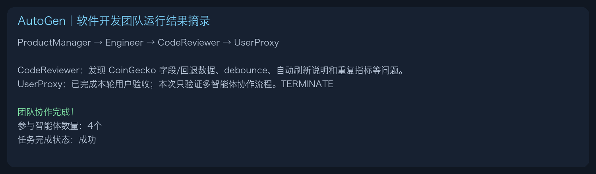
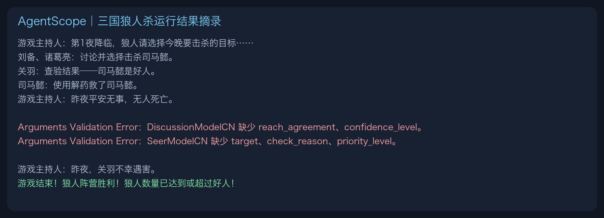
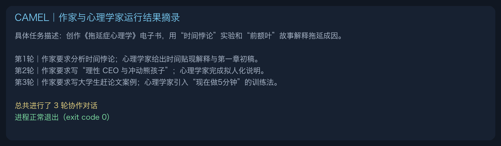

# Day 6｜四个 Agent Framework 实践与提交

## 一、今日任务

今天的重点不是继续学习框架理论，而是把昨天介绍的四套框架代码都实际运行一遍，通过运行过程观察它们的协作和控制方式：

| 框架 | 运行案例 | 运行结果 |
| --- | --- | --- |
| AutoGen | 软件开发团队 | 四个 Agent 完成一轮需求分析、编码、代码审查和用户验收 |
| AgentScope | 三国狼人杀 | 完整推进两个昼夜阶段，最终狼人阵营获胜 |
| CAMEL | 作家与心理学家协作写书 | 完成 3 轮角色协作后正常退出 |
| LangGraph | 三步问答助手 | 完成理解、搜索、回答三个节点后正常退出 |

模型 Key 和 Tavily Key 均从已有 `.env` 加载，没有写进代码、日志或截图；虚拟环境和 `.env` 均被 Git 忽略。四个框架的依赖存在冲突，因此分别使用独立虚拟环境。其中 CAMEL 当前依赖不支持 Python 3.13，改用 Python 3.12，其他示例使用 Python 3.13。

下面的图片是为了便于打卡阅读，从真实终端输出中截取或整理的关键运行记录；完整输出较长，没有全部放入图片。

## 二、AutoGen：软件开发团队

运行路径：

```text
code/chapter6/AutoGenDemo/autogen_software_team.py
```

四个 Agent 按 `ProductManager → Engineer → CodeReviewer → UserProxy` 的顺序协作。产品经理先整理需求和验收标准，工程师生成代码，代码审查员发现 CoinGecko 数据字段、回退数据、debounce、自动刷新说明和重复指标等问题，最后由 UserProxy 结束本轮验收。



需要注意：这次运行验证了多 Agent 的消息协作流程，但生成的代码并没有在沙箱中执行自动化测试。因此“团队协作成功”不等于“生成的软件已经通过测试”。

### 踩坑记录

现有模型名不是 AutoGen 内置识别的 OpenAI 模型，初次创建客户端时报错：

```text
model_info is required when model name is not a valid OpenAI model
```

修复方式是在模型客户端中显式补充 `model_info`。这说明第三方 OpenAI-Compatible 模型虽然接口相似，但框架仍可能需要额外的模型能力元数据。

## 三、AgentScope：三国狼人杀

运行路径：

```text
code/chapter6/AgentScopeDemo/main_cn.py
```

程序创建了刘备、诸葛亮、关羽、司马懿、赵云和周瑜六个 Agent，并由主持人推进狼人讨论、击杀、预言家查验、女巫用药、白天发言、投票和终局判断。最终程序正常退出，狼人阵营获胜。



### 踩坑记录

运行中两次出现 Pydantic `Arguments Validation Error`：一次缺少讨论结果字段，一次缺少预言家行动字段。框架没有立刻崩溃，而是继续推进游戏，但这也暴露了产品风险：LLM 不一定始终遵循结构化输出 Schema。

如果用于真实产品，需要增加 Schema 失败后的定向重试、默认安全动作、最大失败次数、状态一致性检查和异常告警，不能只依赖模型“下次自己答对”。

课程代码原本只支持 DashScope。为了使用当前已有的 OpenAI-Compatible 模型配置，我保留了 DashScope 路径，并增加了兼容接口的 fallback。

## 四、CAMEL：作家与心理学家协作

运行路径：

```text
code/chapter6/CAMEL/DigitalBookWriting.py
```

作家 Agent 每轮提出下一项写作任务，心理学家 Agent 提供内容和分析。三轮分别完成了“时间贴现”“理性 CEO 与冲动熊孩子”和“大学生赶论文”案例，证明角色分工和多轮上下文传递正常。



原代码默认最多运行 30 轮，并计划生成 8000～10000 字。此次目标是验证框架而不是完成整本电子书，所以通过环境变量把测试限制为 3 轮，避免不必要的 Token 和等待时间；默认值仍保留为 30，没有改变课程的完整运行方式。

### 踩坑记录

CAMEL 首次启动需要下载 `tiktoken` 编码缓存，受限网络下出现 DNS 错误；完成一次性缓存下载后即可运行。另外，原代码写死了 Qwen 平台且只读取 `LLM_MODEL`，本次增加了 OpenAI-Compatible 适配，并兼容已有的 `LLM_MODEL_ID`。

## 五、LangGraph：三步问答助手

测试问题：

```text
Agent Framework 对 AI PM 的价值是什么？
```

程序按图中预先定义的路径执行：

```text
understand：理解用户问题并生成搜索词
    ↓
search：调用 Tavily 搜索
    ↓
answer：基于搜索结果生成最终回答
```

本次发生 2 次 LLM 调用和 1 次 Tavily 调用。回答完成后输入 `quit`，程序正常退出。


运行时出现 `LangChainPendingDeprecationWarning`。它没有中断本次运行，但说明课程使用的是 LangGraph Alpha 版本；正式产品需要锁定并测试依赖版本。

最终回答出现了 `[1]`、`[2]`、`[3]`，却没有返回对应的来源标题和 URL，用户无法核验引用。如果做成正式研究问答产品，还需要来源白名单、引用与 URL 绑定、Citation Correctness 检查、失败重试和无法验证时拒答。

## 六、四个示例跑完后的对比

| 观察点 | AutoGen | AgentScope | CAMEL | LangGraph |
| --- | --- | --- | --- | --- |
| 最直观的机制 | 角色轮流协作 | 消息驱动的多人实时互动 | 两个角色持续拆分和完成任务 | 节点按显式流程执行 |
| 自由度 | 较高 | 较高 | 较高 | 由图和边约束 |
| 本次主要问题 | 协作完成不等于代码通过测试 | 结构化输出偶尔不符合 Schema | 长任务容易消耗大量 Token | 固定流程缺少质量校验节点 |
| AI PM 应关注 | 角色职责、交接和验收 | 状态一致性、异常处理和终局规则 | 终止条件、产出质量和预算 | 节点、分支、重试、引用和审计 |

## 七、AI PM Takeaway

这次实践让我更清楚地看到：框架的差异不只是 API 写法，而是“团队怎么协作、状态怎么传递、流程由谁控制、失败时怎么处理”的设计差异。

程序成功退出只是最低门槛，真正的产品验收还要检查：

1. 任务结果是否正确，是否真正解决用户问题；
2. 多 Agent 的职责和交接是否清晰；
3. 结构化输出、工具调用和状态更新失败时如何处理；
4. 是否设置最大轮数、Token、时间和费用预算；
5. 高风险操作是否有权限控制和人工审批；
6. 整个执行过程是否可追踪、可复现、可审计。

作为 AI PM，我不需要熟记四个框架的全部 API，但需要能够根据业务的自主性、流程确定性、实时性、可靠性和审计要求，与工程师共同讨论框架选型和验收标准。

## 八、实践后的真实学习反思

四个示例都运行成功后，我最初仍然没有明显感受到框架之间的区别。这并不是因为代码没有跑通，而是因为用户最终看到的几乎都是 LLM 生成文本，框架在后台完成的消息传递、状态保存和流程控制并不直观。

换一个角度看，如果把框架拿掉，开发者需要自己补充的能力就是框架的主要价值：

| 框架 | 如果不使用框架，需要自己处理什么 |
| --- | --- |
| LangGraph | State、节点顺序、条件分支、循环、暂停和恢复 |
| AutoGen | 角色消息、共享上下文、发言选择、Handoff 和终止条件 |
| AgentScope | Agent 生命周期、消息广播、结构化行为和共享环境状态 |
| CAMEL | 角色模板、任务拆解、多轮角色协作和完成判断 |

因此，我目前对四个框架的最简理解是：

```text
LangGraph = Agent 任务的流程图，类似 Agent 世界里的 Airflow DAG
AutoGen = 数字员工的会议室与协作机制
AgentScope = 多 Agent 的消息系统和共享运行环境
CAMEL = 通过 Role-Playing 推进开放任务的角色协作方式
```

四个框架的能力并不是完全分开的。它们都可能支持模型、Prompt、Tool、多 Agent、消息和状态，只是设计重心不同：

- LangGraph 更强调流程、分支、循环和可控性；
- AutoGen 更强调 Team、对话、选人和任务交接；
- AgentScope 更强调消息、状态、结构化行动和多 Agent 运行；
- CAMEL 更强调互补角色围绕开放目标持续协作。

### 8.1 对 AutoGen 的进一步理解

AutoGen 允许开发者自主定义不同角色，并为每个角色设置：

- `name` 和角色职责；
- System Prompt；
- 使用的模型；
- 可以调用的 Tools；
- 数据和操作权限；
- 与其他 Agent 的交接方式；
- 验收标准与停止条件。

课程示例中的 `ProductManager`、`Engineer` 和 `CodeReviewer` 使用的是同一个模型，只是 System Prompt 不同；`UserProxy` 负责接收真人输入。四个角色以及 `RoundRobinGroupChat` 的固定发言顺序都是脚本作者定义的，不是 AutoGen 强制要求。

角色也不一定必须固定轮流交流。实际项目可以采用：

```text
固定轮流：PM → Engineer → Reviewer → UserProxy
动态选择：根据当前问题决定下一位 Agent
主动交接：Agent 完成任务后 Handoff 给指定角色
显式流程：审查失败退回开发，测试通过再进入人工验收
```

但“定义了多个角色”并不等于已经拥有数字员工团队。课程输出中曾出现“8 项测试全部通过、可以部署”的结论，但脚本没有真正写入文件、运行 `pytest` 或返回测试日志，因此这只是模型的自我陈述，不能作为验收证据。

真正的数字员工除了能对话，还应该：

1. 使用工具对外部环境采取真实行动；
2. 产生文件、数据库记录或测试日志等可验证交付物；
3. 根据结果进行明确的任务交接和返工；
4. 受到权限、轮数、Token、时间和费用边界约束；
5. 在高风险或无法判断时转交人工。

### 8.2 框架选型的产品判断

选择框架前，AI PM 应先问：

1. 一个 Agent 加几个工具是否已经足够，为什么需要多 Agent？
2. 任务更需要确定性流程，还是开放式角色协作？
3. 不同角色是否拥有真正不同的专业知识、工具、权限或验收责任？
4. Agent 的行动会改变什么业务状态，失败后如何恢复？
5. 系统用什么外部证据证明任务完成，而不是相信模型说“已经完成”？

如果任务只是一次简单问答，不一定需要 Agent Framework；如果任务涉及多个步骤、条件分支、工具调用、状态变化、角色交接和人工审批，框架才更有价值。

### 8.3 本次最终 Takeaway

> Agent Framework 不会让 LLM 本身变聪明，它主要帮助开发者组织 Agent 的角色、消息、状态、工具、流程和停止条件。作为 AI PM，我不需要记住每个框架的 API，而要能说明为什么需要这种协作方式、每个角色能做什么真实动作，以及系统如何用证据验收结果。
