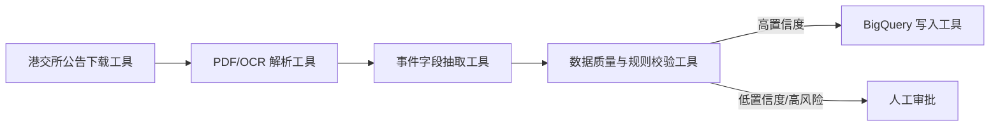
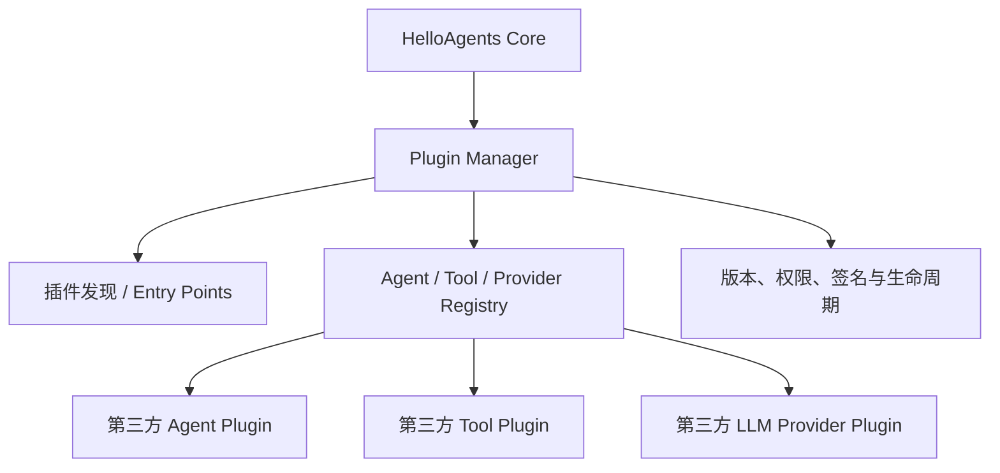

# Day 7｜构建自己的 Agent Framework

## 一、学习目标与实践说明

本章从使用 AutoGen、LangGraph 等成熟框架，转向拆解并设计一个轻量级框架 HelloAgents。重点不是训练模型，而是将 LLM 调用、Message、Config、Agent、Tool 和执行循环封装成可复用组件，为后面的 Memory、RAG、上下文工程和协议扩展打基础。

本次采用“选择性实践”：阅读框架架构与本地示例，完成设计分析和关键代码骨架，不运行第七章全部脚本，也不虚构运行结果。作为应用型 AI PM，我的学习重点是 Build vs Buy、模块边界、扩展性、稳定性、成本、安全和验收，而不是逐行实现底层 Class。

## 二、本章认知框架

```text
用户任务
  ↓
Agent：组织目标、Prompt、历史和执行循环
  ↓
LLM Adapter：统一不同模型供应商
  ↓
Tool Registry：发现、校验并执行工具
  ↓
搜索、计算、数据库、Memory、RAG 等外部能力
```

自建不一定优于成熟框架。实际项目应在直接采用、二次开发和完全自研之间评估。通常先用成熟方案验证价值，当核心能力、性能、安全或扩展性受限时，再逐步自研关键模块。

## 三、习题作答

### 思考题 1：为什么自建框架

#### 1.1 主流框架四个局限及实际影响

| 局限 | 第六章实践中的体现 | 对开发效率的影响 |
| --- | --- | --- |
| 过度抽象 | LangGraph 的 State、Node、Edge 和 Checkpointer 藏在后台，简单直线任务也要理解框架概念 | 入门成本高，问题简单时框架代码可能多于业务逻辑 |
| 快速迭代、不稳定 | LangGraph Alpha 出现弃用警告；AutoGen 需要补充第三方模型的 `model_info` | 升级后需要修改代码和回归测试，版本锁定成本增加 |
| 黑盒化 | AutoGen 输出“测试全部通过”，但示例没有真正执行测试 | 难以判断结果来自真实工具还是模型自述，调试和验收困难 |
| 依赖复杂 | 四个框架需要不同虚拟环境，CAMEL 还需要 Python 3.12 | 安装、部署、漏洞修复和依赖冲突都会增加维护成本 |

这些问题不代表成熟框架不值得使用，而是说明选型时要评估复杂度是否与业务问题匹配。

#### 1.2 “万物皆为工具”的优势与局限

优势：Agent 只面对统一的名称、描述、参数和执行结果；新增搜索、Memory 或 RAG 时不必修改 Agent 核心；可以统一做权限、日志、超时和错误处理，降低学习成本。

局限：统一接口不等于内部复杂度相同。搜索是一次调用，Memory 涉及写入、遗忘和生命周期，RAG 涉及解析、索引、检索、重排和引用，MCP 则是连接工具与数据源的协议。如果都只看成普通函数，可能忽略状态一致性、数据权限和安全边界。

因此，更准确的理解是：

> 对 Agent 而言，各种能力可以通过 Tool 接口暴露；对系统设计者而言，它们仍是职责和风险不同的子系统。

#### 1.3 第四章手写实现与框架化实现

框架化的改进包括：统一 `Agent.run()` 入口；统一 Message 和历史管理；统一模型适配；通过 Tool Registry 管理工具；集中配置最大步数、超时和模型参数；复用异常处理、日志和停止条件。

如果设计框架，我会优先考虑：接口稳定、职责单一、模块解耦、默认安全、可观测、可测试、可替换模型、可控制成本，以及尽量减少不必要的抽象。

### 思考题 2：多模型供应商与本地推理

#### 2.1 新增 DeepSeek Provider 的设计

可以继承 `HelloAgentsLLM`，只处理 DeepSeek 的差异，其他 Provider 继续调用父类：

```python
class DeepSeekLLM(HelloAgentsLLM):
    def __init__(self, model=None, api_key=None, base_url=None, **kwargs):
        super().__init__(
            provider="openai_compatible",
            model=model or os.getenv("DEEPSEEK_MODEL", "deepseek-chat"),
            api_key=api_key or os.getenv("DEEPSEEK_API_KEY"),
            base_url=base_url or "https://api.deepseek.com",
            **kwargs,
        )

    @classmethod
    def can_auto_detect(cls):
        return bool(os.getenv("DEEPSEEK_API_KEY"))
```

生产实现还应检查 Key 是否存在、设置超时和重试，并为配置冲突输出明确警告。本段是设计骨架，未在本次实践中执行。

#### 2.2 自动检测优先级冲突

若同时存在 `OPENAI_API_KEY` 和 `LLM_BASE_URL="http://localhost:11434/v1"`，按照课程“专属环境变量优先于 Base URL”的规则，会选择 OpenAI，而不是 Ollama。

这个规则确定性强，但可能违背用户真实意图。更合理的优先级是：显式 `provider` 参数最高；配置冲突时拒绝静默猜测并给出警告；其次才是专属 Key 和 Base URL 推断。

#### 2.3 vLLM、SGLang、Ollama 对比

| 维度 | vLLM | SGLang | Ollama |
| --- | --- | --- | --- |
| 定位 | 高吞吐、内存高效的模型服务引擎 | 低延迟、高吞吐并强调结构化生成和前缀复用 | 面向个人开发和本地体验的易用运行工具 |
| 易用性 | 需要理解模型、显存和服务参数 | 优化能力丰富，学习和运维要求较高 | 安装、拉取、运行最简单，适合 Mac 和原型 |
| 性能 | PagedAttention、Continuous Batching，适合并发服务 | RadixAttention、Prefix Cache、推测解码和多种并行，适合复杂生产负载 | 优先易用与本地资源适配，一般不是大规模高并发首选 |
| 资源 | 更偏 GPU 服务器，可扩展到分布式 | 从单 GPU 到大型集群，调优空间大 | 量化模型更容易在个人电脑有限内存中运行 |
| 精度 | 同一模型、同一精度配置下不应有本质能力差异 | 同左，但优化和采样配置可能造成数值差异 | 常用量化模型可显著降低资源，也可能损失一定质量 |
| 适用 | 企业推理 API、高并发 | 长前缀复用、结构化生成、复杂推理和大规模服务 | 本地学习、隐私原型、个人开发 |

推理引擎本身不能笼统地说谁“更准确”；质量主要由模型、量化、上下文、采样参数和任务决定，必须用真实业务集评测。官方资料：[vLLM](https://vllm.ai/)、[SGLang](https://docs.sglang.io/)、[Ollama](https://docs.ollama.com/)、[Ollama 量化说明](https://docs.ollama.com/import)。

### 思考题 3：Message、Agent 与 Config

#### 3.1 Pydantic Message 的价值

Pydantic 可以在消息进入系统时校验 `role`、`content`、metadata 等字段，拒绝非法数据；支持类型提示、序列化和 Schema；减少跨 Agent、模型和工具传递时的格式歧义。生产中还应加入消息 ID、时间、会话 ID、调用来源和敏感级别，支持追踪与审计。

#### 3.2 `run()` 与 `_execute()` 的设计模式

这是模板方法模式：父类的公开 `run()` 固定通用骨架，例如校验、日志、异常和历史管理；子类只实现 `_execute()` 的差异逻辑。好处是外部调用统一，公共行为不重复，同时 ReAct、Reflection 等子类仍可扩展。

#### 3.3 Config 单例模式

单例模式保证一个进程中只有一个共享配置实例。它可以避免不同 Agent 读取到不同模型、超时或安全配置，也减少重复加载。若随意创建多个 Config，可能出现配置漂移和难以复现的问题。

但全局单例也会导致测试隔离困难和并发租户相互影响。生产环境更推荐不可变配置加依赖注入，并按请求或租户隔离动态配置。

### 思考题 4：四种 Agent 范式框架化

#### 4.1 ReActAgent 的三个改进

1. 继承统一 Agent 基类，自动复用消息历史、配置和公共接口；
2. 使用 Tool Registry，不再把 Search、Calculator 等执行逻辑写死；
3. Prompt、最大步数和停止条件可配置，并增加解析错误和工具失败处理。

这些改进使 Agent 更容易添加工具、更换模型、单元测试和复用到不同业务。

#### 4.2 Reflection 的质量评分机制

设计为“执行 → 反思 → 独立评分 → 达标结束/不达标优化”：

```python
for round_no in range(max_rounds):
    draft = generate_or_improve(task, draft, reflection)
    reflection = critic.reflect(task, draft)
    score = evaluator.score(task, draft, rubric)  # 返回 0～100

    if score >= threshold:
        return draft

return draft  # 达到硬性轮数后停止
```

评分应使用明确 Rubric，并尽量结合规则、测试或人工证据，不能只相信同一个模型给自己的分数。还要限制最大轮数、Token 和费用。

#### 4.3 Tree-of-Thought Agent 设计

核心过程：每一步生成多个候选思路；独立评分；保留 Top-K；继续扩展，直到找到答案或达到深度限制。

```python
class TreeOfThoughtAgent(Agent):
    def _execute(self, task):
        frontier = [ThoughtNode(text="", score=0)]
        for depth in range(self.max_depth):
            candidates = expand_with_llm(task, frontier, self.branch_factor)
            scored = evaluate_candidates(task, candidates)
            frontier = top_k(scored, self.beam_width)
            if has_valid_final(frontier):
                return best_final(frontier)
        return best_available(frontier)
```

主要风险是分支数导致 Token 指数增长，必须限制深度、分支数和总预算。本次为架构设计，未执行代码。

### 思考题 5：工具系统

#### 5.1 为什么统一 `execute()` 接口

统一接口让 Agent 无须知道每个工具内部实现，也方便统一鉴权、参数校验、超时、重试、日志和测试。多值结果不应拼成难解析的字符串，可以返回结构化 `ToolResult`：

```python
class SearchResult(BaseModel):
    title: str
    summary: str
    url: str

class ToolResult(BaseModel):
    success: bool
    data: list[SearchResult]
    error: str | None = None
```

#### 5.2 三个以上工具的金融公告链



每个节点都应保存输入、输出、证据位置、错误和版本；写入 BigQuery 前必须校验 Schema，并保证幂等。

#### 5.3 什么时候并行工具有价值

适合：多个独立搜索源、读取多份文件、调用互不依赖的 API 等 I/O 密集任务。它能把总等待时间从多个调用耗时之和，降低到接近最慢调用。

不适合：后一个工具依赖前一个结果、共享可变状态、存在严格 Rate Limit，或任务是 Python 线程无法加速的 CPU 密集计算。并行还需要处理超时、部分失败、顺序和幂等。

### 思考题 6：框架扩展设计

#### 6.1 流式输出

需要在 LLM 层提供 `stream_invoke()`，Agent 层提供 `stream_run()`，并定义统一事件：`token`、`tool_start`、`tool_result`、`error`、`done`。API 层可使用 SSE 或 WebSocket 推给前端。

流式输出的验收不能只看“有打字效果”，还要测试首 Token 延迟、中途取消、断线重连、敏感内容拦截和完整消息落库。

#### 6.2 多轮对话、分支和回溯

新增 `ConversationManager`、`ConversationStore` 和 `ContextBuilder`。每条 Message 带 `conversation_id`、`branch_id`、`parent_message_id`，形成消息树；新分支从指定父消息创建；回溯只改变当前分支指针，不删除审计记录。

还要实现上下文窗口裁剪、摘要、长期存储、用户隔离、删除策略和并发版本控制。

#### 6.3 插件系统



关键接口包括 `Plugin.metadata()`、`Plugin.register(registry)`、`Plugin.start()` 和 `Plugin.stop()`。框架启动时发现插件，检查版本兼容与权限后注册，卸载时清理资源。

生产环境必须增加插件签名、依赖隔离、权限清单、沙箱、超时和审计。否则第三方插件可以读取密钥、访问文件或执行危险代码。

## 四、AI PM 总结

本章真正需要带走的不是如何写每个封装，而是：

1. 框架将重复能力标准化，降低模型、Agent 和工具的替换成本；
2. 成熟框架、自研和二次开发需要基于 ROI、团队能力和长期维护成本选择；
3. 统一接口提升扩展性，但不能掩盖不同模块的状态与安全风险；
4. Agent 产品验收必须覆盖任务效果、结构化输出、工具成功率、P95 延迟、单任务成本、恢复能力、权限和审计；
5. 不能把模型声称“完成”当作证据，要使用真实测试、日志、数据库结果或人工审批。

> 对应用型 AI PM 来说，第七章的目标是能看懂 Agent 系统的模块边界，做出 Build vs Buy 判断，并和工程团队共同定义扩展性、稳定性、延迟、成本与安全的验收标准，而不是独立实现生产级框架。

## 五、参考资料

- [Datawhale：第七章 构建你的 Agent 框架](https://github.com/datawhalechina/hello-agents/blob/main/docs/chapter7/%E7%AC%AC%E4%B8%83%E7%AB%A0%20%E6%9E%84%E5%BB%BA%E4%BD%A0%E7%9A%84Agent%E6%A1%86%E6%9E%B6.md)
- [vLLM 官方网站](https://vllm.ai/)
- [SGLang 官方文档](https://docs.sglang.io/)
- [Ollama 官方文档](https://docs.ollama.com/)
